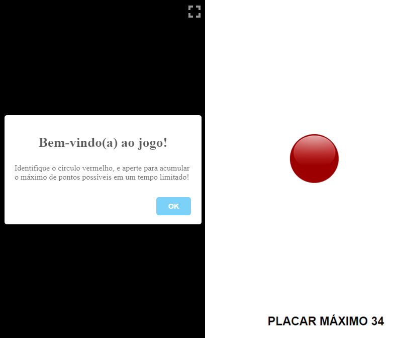

# [Teste Cognitivo para pesssoas especiais](https://luandev-ux.github.io/teste-levi/)
Identifique o círculo vermelho, e aperte para acumular o máximo de pontos possíveis em um tempo limitado!
 
O placar máximo é registrado a cada 30 segundos
 
Este é um jogo simples criado usando HTML, CSS e JS

